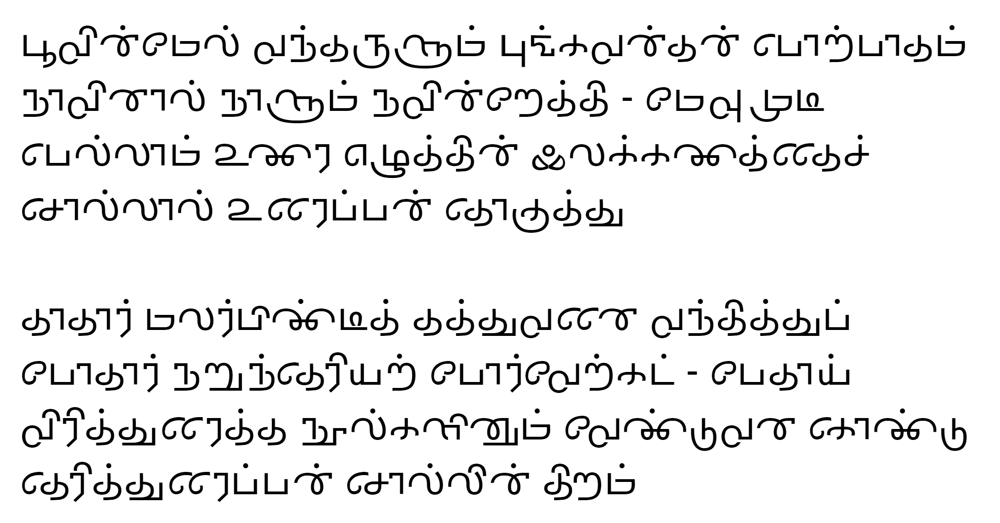

# Arishtanemi Tamil

The modern Tamil script is a result of additions to the source Brahmi characters over 2000 years. Arishtanemi tries to de-evolve the script into a simplified form that looks epigraphic-esque yet readable.

You can read the font documentation [here](http://www.virtualvinodh.com/projects/arishtanemi).

# Sample #

பூவின்மேல் வந்தருளும் புங்கவன்தன் பொற்பாதம் 
நாவினால் நாளும் நவின்றேத்தி - மேவுமுடி 
பெல்லாம் உணர எழுத்தின் இலக்கணத்தைச் 
சொல்லால் உரைப்பன் தொகுத்து 

தாதார் மலர்பிண்டித் தத்துவனை வந்தித்துப் 
போதார் நறுந்தெரியற் போர்வேற்கட் - பேதாய் 
விரித்துரைத்த நூல்களினும் வேண்டுவன கொண்டு 
தெரித்துரைப்பன் சொல்லின் திறம் 

